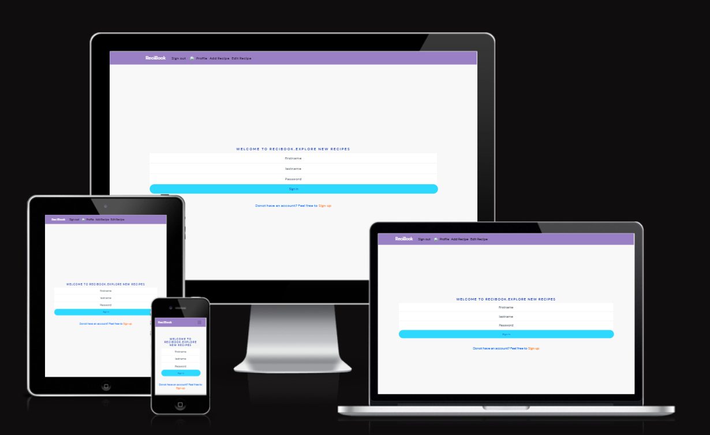
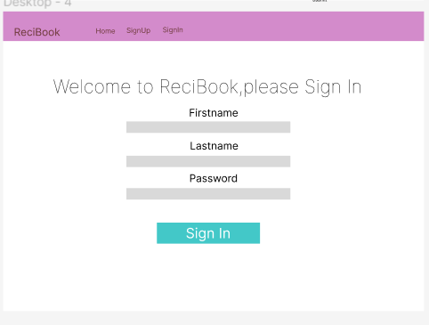
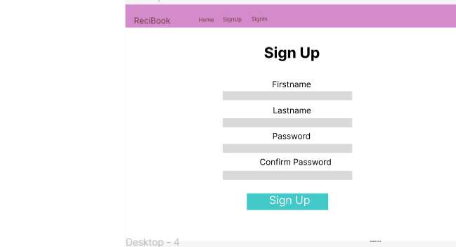

Looking to create new recipesrecipes? Welcome to ReciBook You've come to the right place! ReciBook is a place where you can be very creative and create your own recipes, view, edit and delete these recipes once they are old and not useful. You can create your own free account and add an unlimited number of recipes and share it.This website is also responsive. The website uses React frontend framework to create this project and retreives and sends the data in the backend with the django-api.The user is able to view all those created recipes on a page . The user is able to sign up and sign on this website.The user is also able to create the coments,edit them and delete the comments. The user is able to view all the recipes/posts, comments, and profile from the backend.There is a homepage which prompts user to sign up os sign in and also create a new recipe.

## React
React is a library for building user interfaces, which comprise only one part of an app. Deciding on all the other parts — styles, routers, npm modules, ES6 code, bundling and more — and then figuring out how to use them is a drain on developers. This has become known as javascript fatigue. Despite this complexity, usage of React continues to grow.

A Component is one of the core building blocks of React. In other words UI in React will be made up of pieces called components.Components let you split the UI into independent, reusable pieces, and think about each piece in isolation. Components make the task of building UIs much easier. A UI can be broken down into multiple individual pieces called components and work on them independently and merge them all in a parent component which will be your final UI.

Conceptually, components are like JavaScript functions. They accept arbitrary inputs (called “props”) and return React elements describing what should appear on the screen.

The reuasble component in this project is for example is the Navigation bar, Asset. These reusable components are used in several pages

### Architecture of the React Application
React architecture is a collection of components responsible for building a software’s User Interface (UI). You can also see it as an organization of your codebase that helps you build your unique project. 

For example, a React architecture will include several UI components such as buttons, forms, API services, Central State Management services, etc. 

Because of this ReactJs architectural freedom, it is the most preferred JavaScript library (framework) for building front-end applications. Get to know more about React.js features. 

- React app starts with a single root component.

- Root component is build using one or more component.

- Each component can be nested with other component to any level.

- Most of the components are user interface components.

- React app can include third party component for specific purpose such as routing, animation, state management, etc.

This App uses several UI componetnst such as Buttons,Row, Columns,Container etc in different files
 
## React Bootstrap
React Bootstap was used for this project.React Bootstrap is the rebuilt version of the popular frontend CSS framework for React. Each component of the React Bootstrap is built from scratch with no unneeded dependencies and is accessible by default.

There is a total of 27 components with a consistent design that is compatible with core bootstrap and can be easily put into production. This App uses several UI componetnst such as Buttons,Row, Columns,Container etc in different files. 
React-Bootstrap is a complete re-implementation of the Bootstrap components using React. It has no dependency on either bootstrap.js or jQuery. If you have React setup and React-Bootstrap installed, you have everything you need.

Methods and events using jQuery is done imperatively by directly manipulating the DOM. In contrast, React uses updates to the state to update the virtual DOM. In this way, React-Bootstrap provides a more reliable solution by incorporating Bootstrap functionality into React's virtual DOM. 

More Information regarding the React Boostrap can be found on "https://react-bootstrap.github.io/docs/getting-started/introduction"

## Getting Started with Create React App
This project was bootstrapped with Create React App.

Available Scripts
In the project directory, you can run:

npm start
Runs the app in the development mode.
Open http://localhost:3000 to view it in the browser.

npm run build
Builds the app for production to the build folder.
It correctly bundles React in production mode and optimizes the build for the best performance.

The build is minified and the filenames include the hashes.
Your app is ready to be deployed!

See the section about deployment for more information.

npm run eject
Note: this is a one-way operation. Once you eject, you can’t go back!

If you aren’t satisfied with the build tool and configuration choices, you can eject at any time. This command will remove the single build dependency from your project.

Instead, it will copy all the configuration files and the transitive dependencies (webpack, Babel, ESLint, etc) right into your project so you have full control over them. All of the commands except eject will still work, but they will point to the copied scripts so you can tweak them. At this point you’re on your own.

You don’t have to ever use eject. The curated feature set is suitable for small and middle deployments, and you shouldn’t feel obligated to use this feature. However we understand that this tool wouldn’t be useful if you couldn’t customize it when you are ready for it.

Learn More
You can learn more in the Create React App documentation.

To learn React, check out the React documentation.

Code Splitting
This section has moved here: https://facebook.github.io/create-react-app/docs/code-splitting

Analyzing the Bundle Size
This section has moved here: https://facebook.github.io/create-react-app/docs/analyzing-the-bundle-size

Making a Progressive Web App
This section has moved here: https://facebook.github.io/create-react-app/docs/making-a-progressive-web-app

Advanced Configuration
This section has moved here: https://facebook.github.io/create-react-app/docs/advanced-configuration

Deployment
This section has moved here: https://facebook.github.io/create-react-app/docs/deployment

npm run build fails to minify
This section has moved here: https://facebook.github.io/create-react-app/docs/troubleshooting#npm-run-build-fails-to-minify

## UX
### User Stories
* Navigation: As a user I would like to view the navbar, click on different options present on the navigation bar so that I can    navigate easily between pages
  Result: I was able to go the navigation bar,click on different options present on it and I could navigate easily between pages

* Sign up: As a user I would like to create a new account so that I can access all the features for signed up users such as create recipes etc
  Result: I was able to go the Home page, signup from there and was able to access all the features for signed up users such as create recipes etc

* Sign in: As a user I woud like to sign in to the app so that I can access functionality for logged in users
  * Result: I was able to go the Home page, signuin from there and was able to access all the features for signed in users such as create recipes etc

* Add Recipe:As a user I would like to add recipes to the app so that I can add my recipe
  * Result: I was able to add Recipe with the Add Recipe button on the Navbar

* Edit Recipe:As a user I would like to edit the recipes to the app so that I can view my changes on the recipe
  * Result: I was able to edit the Recipe with the Edit button and view my changes

* Delete Recipes:As a user I would like to delete the recipes to the app so that I can delete the recipes which I dont want to have
  * Result: I was able to delete the Recipes with the Delete button and those recipes were no more available

* Add Comments:As a user I would like to add comments for the overall website so that I can express my opinion about the website
  * Result: I was able to add comment with the Add Comment button on the Navbar so that I can express my opinion about the overal website

* Edit Comment:As a user I would like to edit the comments to the app so that I can view my changes on the recipe
  * Result: I was able to edit the Comments with the Edit button and view my changes

* Delete Comments:As a user I would like to delete the comments to the app so that I can delete the coments which I dont want to have
  * Result: I was able to delete the Recipes with the Delete button and those recipes were no more available

* View Existing Profiles; As a user I would like to view the existing profile so that I can have an idea what kind of people are posting on this website
  * Result: I was able to view the existing profiles with the View Profile button on the Nav bar and have an idea of who was posting on the website

## Wireframe:
Mockups were designed using Figma.The color scheme was chosen  based on what will look good to users eye.

The mockups show the initial color scheme but eventually it was developed/modified during the course of the project 

## Existing Features
Register Account
Anybody can register for free and create their own unique account.
Log In to Account
Users can easily log out of their account with the click of a button.
Log Out of Account
Users can easily log out of their account with the click of a button.

## Kanban Board

## Technologies Used
 React,Heroku,Javascript

## Agile Method:
The agile Methodology was used and different user stories were created using Kanban board and implemented for the project.

### Validators
W3C HTML Validator - No errors found

W3C CSS Validator -No errors found

JShint:
only warnings found

PEP8 Online:
No errors found

Testing of user stories

## Manual Testing for Front End
* Creation of the posts: As a user I can create the recipeposts on this website
  * Result:Pass, I was able to create the recipepost on this website

* Editing of the posts:As a user I can edit my posts and see those changes on the website as well
  * Result:Pass, I can make those changes on my recipes and also see those changes on the website

* Deleting of the posts: As a developer I can delete the recipes posts which I dont want anymore
  * Result:Pass, I was able to delete a recipes which i dint want anymore on my website

* Viewing/Receiving of all Recipes from the backend: As a user, I was able to see all the recipes created so far
  * Result:Pass, it was possible to receive all the recipesfrom the backend and see it in the front end

* Signup: As a developer i could easily signup on the website so as to create further recipes
  * Result:Pass, I was able to Signup on the website

* Navigation Test: As a user I can view a navbar from every page so that I can navigate easily between pages
  * Result: Pass, A navigation bar was found and i could easily navigate between different pages through this navbar

* Sign in Test: As a user I can sign in to the app ans use the website
  * Result: Pass, A sign in page was found where i could sign in and start creating or adding my recipes

* HomePage Navigation: As a user as i enter on the home page of the website, its clearly directed that i could create the 
  recipe after signing up or there is a possibilty of directly signing up and signing in and then creating the recipes
  * Result:Pass, On the Homepage when we click on ReciBook logo we are directed to this page where all above mentioned options were found

* Creation of the comments: As a user I can create the comments on this website
  * Result:Pass, I was able to create the comments on this website

* Editing of the comments: As a user I can edit my comments and see those changes on the website as well
  * Result:Pass, I can make those changes on my comments and also see those changes on the website

* Deleting of the comments: As a developer I can delete the comments which I dont want anymore
  * Result:Pass, I was able to delete a comments which i dint want anymore on my website

* Viewing/Receiving of all comments : As a user, I was able to see all the comments created so far
  * Result:Pass, it was possible to receive all the comments the backend and see it in the front end

*Viewing/Receiving of all profiles :  As a user, I was able to see all the profiles created so far
  * Result:Pass, it was possible to receive all the profiels from the backend and view it in the front end

## Pages present in the project and its related functionality:
  There are different pages present which help the user to access different functionality

* HomePage:Gives the opportunity to the user to signup/sign and also create the recipe once they are signed in
* Signin page: This page helps the user to sign in
* Signup page:Helps the user to create the new account and signup
* AddRecipe Page:lets the suer to create or add new recipes
* ShowRecipe Page: gives the overview of the the newly added and the existing recipes/posts
* EditRecipePage:lets the user to edit the existing recipes
* AddComment Page:lets the suer to create or add new comments
* ShowComment Page: gives the overview of the the newly added and the existing comments
* EditCommet:lets the user to edit the existing comments
* ShowProfiles: YOu can view different recipes

### Deployment

In the final steps of development, following was carried out

* In package.json file, in the “scripts” section, add the following prebuild command:

* "heroku-prebuild": "npm install -g serve",
This will install a package needed to serve our single page application on heroku

* Add a Procfile at the root of the project with the following web command:

web: serve -s build

* All the changes were committed and pushed all to github.

* Log in to heroku.com and open the dashboard for your react application (remember this is separate from the DRF application 
  that runs your API)

* Select the “Deploy” tab in the dashboard

* Scroll down to the bottom and then select “Deploy Branch”

* Wait for your build to complete (you can click “view build log” to watch the process in a larger window)

* When you see the message “deployed to Heroku” in the build log, click the “open app” button at the top of the page. or 
  once the build was succesful and fucntional the generated deployed link was generated and shared further for the submission

### API testing
* As I have created several posts i am able to call my api and all those posts from api and and read them
* As i have several posts in backend API I am able to call them view (in the view recipe, once i am logged in) them as well 
  as edit them from my api

### Things that could be improved
* UI can be improved 
* More images can be added
* It can be made more interactive
* A search bar could be added to filter the posts
* The recipes could be liked, followed by other users
* The comments could be liked or followed by the other users

## Acknowledgements and Credits
Mentor and Tutor support Media Info Inspired by "Moments App",some of the text was inspired by he Readme file on React Bootstrap website